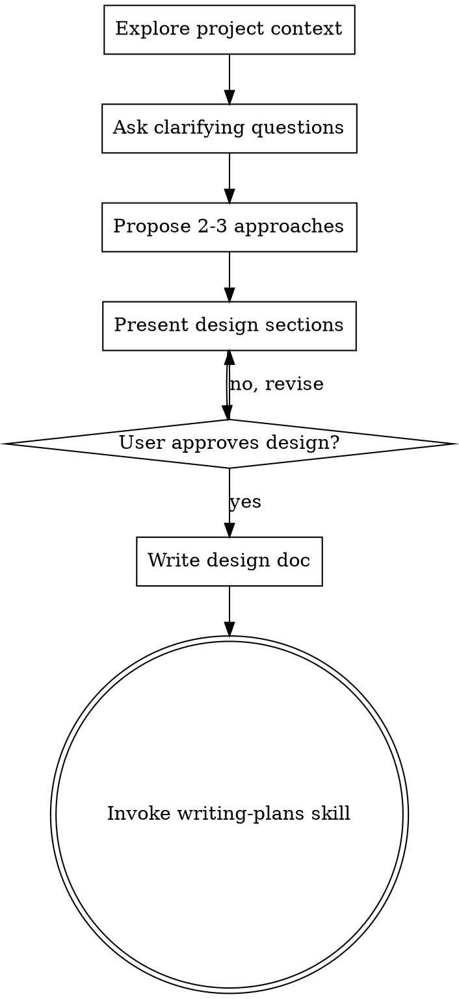

# Session 4: 1주일 캠프에서 해결하고 싶은 문제에 대해 엣지있게 정의해 보자.

- **Session ID**: `7f7cc209-d458-4b19-9dd2-04277613ba89`
- **시작 시각**: 2026-02-16 08:51 KST
- **메시지 수**: 35

---

### User (08:51:00)

1주일 캠프에서 해결하고 싶은 문제에 대해 엣지있게 정의해 보자.

---

### Assistant (08:51:07)

Using the brainstorming skill to sharpen the problem definition together.

---

### Assistant (08:51:07)

[Skill: superpowers:brainstorming]

---

### User (08:51:07)

Base directory for this skill: /Users/donghoon-lee/.claude/plugins/cache/claude-plugins-official/superpowers/4.3.0/skills/brainstorming

# Brainstorming Ideas Into Designs

## Overview

Help turn ideas into fully formed designs and specs through natural collaborative dialogue.

Start by understanding the current project context, then ask questions one at a time to refine the idea. Once you understand what you're building, present the design and get user approval.

<HARD-GATE>
Do NOT invoke any implementation skill, write any code, scaffold any project, or take any implementation action until you have presented a design and the user has approved it. This applies to EVERY project regardless of perceived simplicity.
</HARD-GATE>

## Anti-Pattern: "This Is Too Simple To Need A Design"

Every project goes through this process. A todo list, a single-function utility, a config change — all of them. "Simple" projects are where unexamined assumptions cause the most wasted work. The design can be short (a few sentences for truly simple projects), but you MUST present it and get approval.

## Checklist

You MUST create a task for each of these items and complete them in order:

1. **Explore project context** — check files, docs, recent commits
2. **Ask clarifying questions** — one at a time, understand purpose/constraints/success criteria
3. **Propose 2-3 approaches** — with trade-offs and your recommendation
4. **Present design** — in sections scaled to their complexity, get user approval after each section
5. **Write design doc** — save to `docs/plans/YYYY-MM-DD-<topic>-design.md` and commit
6. **Transition to implementation** — invoke writing-plans skill to create implementation plan

## Process Flow

**The terminal state is invoking writing-plans.** Do NOT invoke frontend-design, mcp-builder, or any other implementation skill. The ONLY skill you invoke after brainstorming is writing-plans.

## The Process

**Understanding the idea:**
- Check out the current project state first (files, docs, recent commits)
- Ask questions one at a time to refine the idea
- Prefer multiple choice questions when possible, but open-ended is fine too
- Only one question per message - if a topic needs more exploration, break it into multiple questions
- Focus on understanding: purpose, constraints, success criteria

**Exploring approaches:**
- Propose 2-3 different approaches with trade-offs
- Present options conversationally with your recommendation and reasoning
- Lead with your recommended option and explain why

**Presenting the design:**
- Once you believe you understand what you're building, present the design
- Scale each section to its complexity: a few sentences if straightforward, up to 200-300 words if nuanced
- Ask after each section whether it looks right so far
- Cover: architecture, components, data flow, error handling, testing
- Be ready to go back and clarify if something doesn't make sense

## After the Design

**Documentation:**
- Write the validated design to `docs/plans/YYYY-MM-DD-<topic>-design.md`
- Use elements-of-style:writing-clearly-and-concisely skill if available
- Commit the design document to git

**Implementation:**
- Invoke the writing-plans skill to create a detailed implementation plan
- Do NOT invoke any other skill. writing-plans is the next step.

## Key Principles

- **One question at a time** - Don't overwhelm with multiple questions
- **Multiple choice preferred** - Easier to answer than open-ended when possible
- **YAGNI ruthlessly** - Remove unnecessary features from all designs
- **Explore alternatives** - Always propose 2-3 approaches before settling
- **Incremental validation** - Present design, get approval before moving on
- **Be flexible** - Go back and clarify when something doesn't make sense

---

### Assistant (08:51:12)

먼저 프로젝트 컨텍스트를 살펴보겠습니다.

---

### Assistant (08:51:13)

[Tool: Bash → `List project directory contents`]

---

### Assistant (08:51:14)

[Tool: Glob → **/*]

---

### Assistant (08:51:17)

[Tool: Read → /Users/donghoon-lee/Working/2026/02/16/ai-native-camp/references/SELF_INTRODUCTION.md]

---

### Assistant (08:51:17)

[Tool: Read → /Users/donghoon-lee/Working/2026/02/16/ai-native-camp/day1/HOMEWORKS.md]

---

### Assistant (08:51:36)

컨텍스트를 파악했습니다. CLAUDE.md와 자기소개, 숙제 내용까지 확인했습니다.

지금 CLAUDE.md에 적힌 문제의식을 보면 이렇습니다:

> "많은 구성원들이 AI를 1차적 질문에만 쓰고, 한 번 안 되면 포기한다."

이건 **현상 기술**이지, 아직 엣지 있는 문제 정의는 아닙니다. "사람들이 AI를 잘 못 쓴다"는 누구나 하는 말이거든요.

엣지를 세우려면 몇 가지를 더 파야 합니다. 그리고 1주일 뒤 산출물도 함께 잡아야 한다고 하셨으니, 문제를 날카롭게 정의하면서 동시에 "뭘 만들 건지"도 같이 잡아보겠습니다.

먼저 문제의 핵심을 좁혀볼게요.

---

### Assistant (08:51:43)

[질문: "AI를 잘 못 쓰는 구성원"이라고 했을 때, 가장 먼저 떠오르는 구체적인 사람(또는 직군)과 그 사람이 실패한 구체적인 장면이 뭔가요? 예를 들어 '기획자 A가 Claude에게 PRD 작성을 시켜봤는데 결과가 구려서 포기했다' 같은 수준의 구체성으로요.]

---

### Assistant (08:54:05)

아주 좋은 사례들이 나왔습니다. 정리하면 이런 패턴이 보입니다:

| 직군 | 실패 장면 | 근본 원인 |
|------|----------|----------|
| 개발자 | 이미 있는 솔루션을 모르고 새로 만듦 | 충분한 리서치를 안 돌림 |
| 비개발자 | 내부 시스템 구조를 몰라서 팀 간 소통 실패 | 자기 조직의 기술 맥락을 모름 |
| 비개발자 | AI가 상황을 오해하고 잘못된 답을 줌 | 맥락을 AI에게 전달 못함 |
| 비개발자 | 웹 자동화에서 막힘 | HTML/CSS/JS/DOM 기초 개념 부재 |

공통점이 하나로 수렴합니다: **"자기가 다루는 영역의 멘탈 모델이 없으니, AI에게 맥락을 줄 수도 없고, AI의 답을 평가할 수도 없다."**

그런데 여기서 한 단계 더 파야 엣지가 생깁니다.

---

### Assistant (08:54:25)

[질문: 동훈님 본인은 이 문제를 이미 넘어선 사람이잠아요. 동훈님이 AI를 잘 쓰는 이유가 '똑똑해서'라고는 생각 안 하실 거고요. 동훈님과 다른 구성원들 사이의 차이를 한 문장으로 말한다면 뭐라고 표현하시겠어요?]

---

### Assistant (08:56:05)

좋습니다. 이제 차이가 선명하게 보입니다. 정리하면:

1. **기술적 배경지식** — 자기 영역의 개념 체계
2. **AI 동작 원리 이해** — 왜 이렇게 답하는지, 어떻게 하면 다르게 답하는지
3. **전략 레퍼토리** — 1차 시도가 실패했을 때 다음 수를 아는 것

이 세 가지가 없으면 사람들은 AI를 **자판기**처럼 씁니다. 넣었는데 원하는 게 안 나오면 발로 차고 가는 거죠. 반면 동훈님은 AI를 **대화 상대**로 씁니다. 맥락을 주고, 답을 평가하고, 전략을 바꿔가면서 원하는 결과에 수렴해 가는.

그런데 여기서 Workshop으로 해결 가능한 범위를 잘라야 합니다. 1번(기술적 배경지식)은 Workshop 1주일에 줄 수 있는 게 아닙니다. 개발자가 아닌 사람에게 HTML/CSS/JS를 일주일에 가르칠 순 없으니까요.

그러면 엣지 있는 문제 정의의 후보가 좁혀집니다:

> **"구성원들에게 2번(AI 동작 원리)과 3번(전략 레퍼토리)을 줘서, 자기 기존 지식만으로도 AI와 생산적인 대화를 할 수 있게 만드는 것"**

즉, 도메인 지식을 늘려주는 게 아니라, **이미 알고 있는 것을 AI에게 잘 전달하는 법**과 **안 될 때 다음 수를 두는 법**을 가르치는 것.

---

### Assistant (08:56:18)

[질문: 이 방향에 동의하시나요? 아니면 1번(기술적 배경지식)도 Workshop 범위에 넣고 싶으신 건가요?]

---

### Assistant (08:57:01)

이거 핵심을 짚으셨습니다. 방금 말씀하신 걸 더 날카롭게 다듬어 보겠습니다.

사람들이 AI를 못 쓰는 진짜 이유는 **"개념어 지도(Concept Map)가 없어서"**입니다.

- HTML이 뭔지 **디테일**을 모르는 게 문제가 아니라, "웹페이지는 HTML(구조) + CSS(스타일) + JS(동작)로 되어 있고, DOM이라는 게 JS가 페이지를 보는 방식이다" — 이 **한 문장짜리 지도**가 없는 게 문제.
- 이 지도가 없으면 **질문 자체를 만들 수 없음**. "DOM"이라는 단어를 모르면 검색도 못하고, AI에게 물어볼 수도 없음.
- 지도가 있으면 디테일은 AI가 채워줌. "DOM이 뭔지는 알겠는데, 특정 요소를 선택하려면 어떻게 해?" — 이렇게 물을 수 있으니까.

**교육학에서 이걸 "어휘가 이해에 선행한다(vocabulary precedes understanding)"라고 합니다.** 이름을 모르면 생각할 수 없고, 생각할 수 없으면 질문할 수 없습니다.

그러면 문제 정의가 이렇게 날카로워집니다:

> **"구성원들에게 자기 업무 영역의 개념어 지도(Concept Map)를 주면, AI에게 풍부한 질문을 할 수 있게 되고, 디테일은 AI가 채운다. Workshop은 이 지도를 만들어주는 자리다."**

이건 기존의 "AI 사용법을 가르치자"와 근본적으로 다릅니다. 프롬프트 엔지니어링이 아니라, **문제 영역의 개념 체계를 잡아주는 것**이 핵심이 됩니다.

---

### Assistant (08:57:12)

[질문: 이 프레이밍에 대해 어떻게 생각하세요? 방향이 맞다면, 1주일 뒤 산출물로 넘어가 보겠습니다.]

---

### Assistant (08:57:45)

좋습니다. 그러면 1주일 뒤 산출물을 잡아보겠습니다.

문제 정의가 **"개념어 지도를 줘서 AI에게 풍부한 질문을 할 수 있게 만든다"**이니까, 산출물은 이 Workshop을 실제로 돌릴 수 있는 수준이어야 합니다.

---

### Assistant (08:57:57)

[질문: 1주일 뒤 산출물로 어떤 수준을 기대하세요?]

---

### Assistant (08:58:39)

좋습니다. 이제 산출물 범위가 잡혔으니, 문제 정의와 산출물을 하나의 날카로운 문장으로 통합해 보겠습니다.

그 전에 하나만 더 확인하겠습니다.

---

### Assistant (08:58:51)

[질문: Workshop 대상자를 어떻게 잡으시나요? 이게 커리큘럼 구조를 크게 바꿀 수 있어서요.]

---

### Assistant (08:59:19)

좋습니다. 이제 모든 재료가 모였습니다. 엣지 있는 문제 정의를 정리합니다.

---

## 문제 정의 (Draft)

### 현상
구성원들이 AI에게 1차적 질문만 하고, 안 되면 포기한다.

### 진짜 원인 (엣지)
**프롬프트 스킬이 부족한 게 아니다. 개념어 지도(Concept Map)가 없는 거다.**

- "DOM"이라는 단어를 모르면 "DOM 요소를 선택하려면?"이라는 질문 자체가 불가능
- 개념어를 모르면 → 맥락을 AI에게 전달 못함 → AI가 엉뚱한 답을 줌 → "AI 못 쓰겠다"
- 디테일을 다 알 필요는 없다. **"웹 = HTML(구조) + CSS(스타일) + JS(동작) + DOM(접근방식)"** — 이 한 문장만 알면 나머지는 AI가 채워준다
- 개발자도 마찬가지: 이미 존재하는 솔루션의 **이름과 카테고리**를 모르면 리서치 자체를 못 한다

### Workshop이 해결할 것
**"개념어 지도를 주면, AI에게 풍부한 질문이 가능해진다."**

1. **개념어 지도** — 업무 영역별 핵심 개념과 그 관계를 한 장으로 정리
2. **AI 동작 원리** — 왜 이렇게 답하는지, 컨텍스트가 왜 중요한지
3. **전략 레퍼토리** — 1차 시도 실패 시 다음 수를 두는 방법들

### 1주일 뒤 산출물
- **Workshop 커리큘럼** (세션별 내용/시간/진행 방식)
- **실습 자료** (개념어 지도 템플릿, 실습 문제, Before/After 사례)
- 대상: 개발자 + 비개발자 통합, 실습은 트랙 분리

---

---

### Assistant (08:59:28)

[질문: 이 문제 정의와 산출물 정의가 날카로운가요? 수정할 부분이 있으면 말씩해 주세요.]

---

### Assistant (09:00:21)

[질문: 어느 부분을 다듬고 싶으세요?]

---

### Assistant (09:01:13)

좋은 의문입니다. 다시 생각해 보면, 개념어 지도는 **필요조건이지 충분조건이 아닙니다.** 

단어를 알아도 이런 상황이 발생할 수 있으니까요:

- DOM이 뭔지 알지만, AI가 틀린 코드를 줬는데 **맞는지 틀린지 판단을 못함**
- 개념은 아는데, AI에게 **어떤 순서로 어떻게 물어야 하는지** 모름
- 한 번 시도해서 "대충 되는" 결과를 받았는데, **더 좋은 결과가 가능하다는 걸 모름**

결국 세 개의 기둥이 다 있어야 합니다:

| 기둥 | 없으면 벌어지는 일 |
|------|-------------------|
| **1. 개념어 지도** | 질문 자체를 못 만든다 |
| **2. AI 리터러시** | AI가 왜 이렇게 답하는지 모르니 맥락을 안 주고, 환각을 못 걸러낸다 |
| **3. 대화 전략** | 1차 시도에서 멈춘다. "더 좋은 답"을 끌어내는 법을 모른다 |

개념어 지도만 강조하면 "단어 공부 시키는 Workshop"이 되고, AI 리터러시만 강조하면 "프롬프트 엔지니어링 강의"가 됩니다. 세 기둥이 맞물려야 실제로 동작합니다.

문제 정의를 수정하면:

> **"구성원들이 AI를 자판기처럼 쓰고 포기하는 이유는 세 가지가 빠져 있어서다: (1) 자기 업무 영역의 개념어 지도, (2) AI가 어떻게 동작하는지에 대한 이해, (3) 안 될 때 다음 수를 두는 대화 전략. Workshop은 이 세 기둥을 세워주는 자리다."**

---

### Assistant (09:01:24)

[질문: 세 기둥 프레이밍이 더 완전한가요? 아니면 여전히 빠진 게 있다고 느껴지나요?]

---

### Assistant (09:02:54)

좋습니다. 그러면 최종 문제 정의와 산출물을 정리해서 문서로 남기겠습니다.

---

## 최종 문제 정의

**한 문장 버전:**
> 구성원들이 AI를 자판기처럼 쓰고 포기하는 이유는, 자기 영역의 **개념어 지도**와 **AI 동작 원리에 대한 이해**, 그리고 **실패 시 다음 수를 두는 전략**이 없기 때문이다.

**엣지:**
- 이건 "프롬프트 엔지니어링" 문제가 아니다. 프롬프트 기법을 가르쳐도 도메인 어휘가 없으면 소용없다.
- 이건 "AI 도구 사용법" 문제도 아니다. 도구 UI를 가르쳐도 대화 전략이 없으면 1차 시도에서 멈춘다.
- 핵심은 **세 기둥이 동시에 서야 한다**는 것이다:
  1. 개념어 지도 — "질문할 수 있는 어휘"
  2. AI 리터러시 — "왜 이렇게 답하는지 이해"
  3. 대화 전략 — "안 될 때 다음 수를 아는 것"

**1주일 산출물:**
- Workshop 커리큘럼 (세션별 내용/시간/진행 방식)
- 실습 자료 (개념어 지도 템플릿, 실습 문제, Before/After 사례)
- 대상: 개발자 + 비개발자 통합, 실습은 트랙 분리

---

---

### Assistant (09:02:56)

[Tool: Bash → `Create plans directory`]

---

### Assistant (09:03:23)

[Tool: Write → /Users/donghoon-lee/Working/2026/02/16/ai-native-camp/docs/plans/2026-02-16-problem-definition-design.md]

---

### Assistant (09:03:26)

day1 디렉토리로 옮기겠습니다.

---

### Assistant (09:03:28)

[Tool: Bash → `Move design doc to day1 and clean up empty docs dir`]

---

### Assistant (09:03:34)

`day1/2026-02-16-problem-definition-design.md`에 저장했습니다.

정리하면, 오늘 잡은 것:

**문제의 엣지:** AI를 못 쓰는 건 프롬프트 스킬 문제가 아니라, 세 기둥(개념어 지도 + AI 리터러시 + 대화 전략)의 부재다.

**1주일 산출물:** 이 세 기둥을 세워주는 Workshop 커리큘럼 + 실습 자료

다음 단계로 넘어갈 준비가 되면 말씀해 주세요. 커리큘럼 구조를 잡아볼 수 있습니다.

---

### User (09:03:56)

preview that

---

### Assistant (09:03:59)

[Tool: Bash → `Preview markdown in browser`]

---

### Assistant (09:04:02)

브라우저에서 열렸습니다.

---
